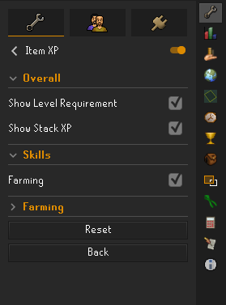
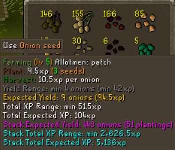

# Item XP Plugin

A plugin that adds tooltips to items to show how much XP can be gained by using the item.

**PLEASE NOTE:** *This plugin is in BETA stage and does not yet have full functionality. Refer to [Supported Skills](#supported-skills) section below.*

## Configuring Item XP Plugin
You will first need to download the Item XP Plugin from the Runelite Plugin Hub.

You should then ensure that the plugin is turned on. You can choose relevant options and turn skills on/off.

Each skill has its own section for configuring settings specific to that skill.

## Using Item XP Plugin

You just hover over an item and a tooltip will be added showing how much xp can be gained in the relevant skill.

## Supported Skills

- Farming
- Prayer
- Firemaking
 
*Other skills will be added in future updates.*